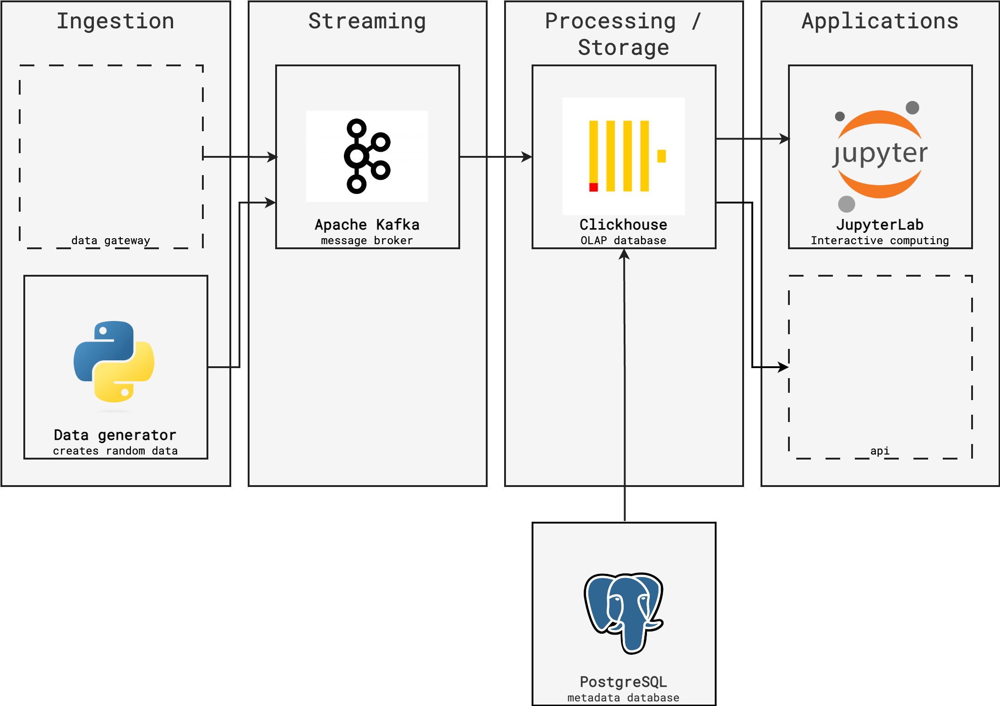

# Data-Platform based on ClickHouse demo
This project demonstrates how to make a dataplatform that is scalable by design. When the volume of data increases, the amount of nodes and partitions / shard can easily be increased.

## Design


## Prerequisites:
- Access to a [Kubernetes](https://kubernetes.io/) cluster
  - [Nginx ingress controller](https://github.com/kubernetes/ingress-nginx) deployed
- [Docker](https://docs.docker.com/get-docker/)
- [Kubectl](https://kubernetes.io/docs/tasks/tools/) 
- [Helm](https://helm.sh/docs/intro/install/)

## Installation
### Create Kind (K8s In Docker) cluster
```sh
# Create cluster with 4 worker nodes
kind create cluster --name kind-dataplatform --config=kind.yaml

# Install nginx ingress controller
kubectl apply -f https://raw.githubusercontent.com/kubernetes/ingress-nginx/main/deploy/static/provider/kind/deploy.yaml
```

Use cluster:
```sh
kubectl config use-context kind-kind-dataplatform 
```

### Install operators
A [Kubernetes Operator](https://kubernetes.io/docs/concepts/extend-kubernetes/operator/) can deploy workloads based on [Customer Resource definition](https://kubernetes.io/docs/concepts/extend-kubernetes/api-extension/custom-resources/) that defines it. Updates to the resources will also managed by the operator.

Operators are always installed cluster-wide.
```sh
# Install Altinity Clickhouse Operator
kubectl apply -f https://raw.githubusercontent.com/Altinity/clickhouse-operator/master/deploy/operator/clickhouse-operator-install-bundle.yaml

# Install Strimzi Kafka operator
helm repo add strimzi https://strimzi.io/charts/
helm install strimzi-kafka-operator strimzi/strimzi-kafka-operator

# Install CloudNativePG PostgreSQL Operator
kubectl apply -f https://raw.githubusercontent.com/cloudnative-pg/cloudnative-pg/release-1.20/releases/cnpg-1.20.0.yaml
```

### Custom images
The `jupyterlab` image is based on the [datascience-notebook](https://github.com/jupyter/docker-stacks/tree/main/datascience-notebook). It comes with default notebooks and install required dependencies.
```sh
docker build ./jupyterlab -t dataplatform-jupyterlab:latest
kind load docker-image dataplatform-jupyterlab:latest --name kind-dataplatform

docker build ./setup-data -t setup-data:latest
kind load docker-image  setup-data:latest --name kind-dataplatform

docker build ./data-generator -t data-generator:latest
kind load docker-image data-generator:latest --name kind-dataplatform
```


### Install or upgrade Data-Platform
This demo in contained in a HELM chart.
```sh
helm dependency build ./dataplatform-chart
helm upgrade --install dataplatform ./dataplatform-chart --set jupyter.image=dataplatform-jupyterlab:latest
```


